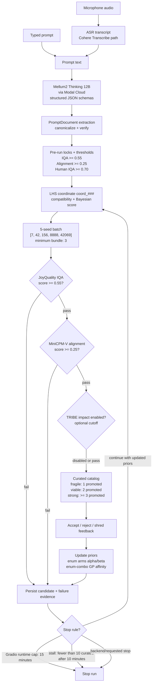

# Bruteforce Canvas

Bruteforce Canvas is a local-first image generation and evaluation loop. It turns a user prompt into a structured prompt document, renders generation coordinates, generates candidate images, evaluates them, promotes the strongest candidates, and records the run to a replayable JSONL event store.

It was built to make image iteration less subjective. The system keeps generation, quality scoring, prompt-image alignment, thresholds, feedback, and replay telemetry in one workflow so a user can inspect why an image was promoted or rejected.

## License

This repository is licensed under CC BY-NC 4.0. The non-commercial license posture is intentional because the optional TRIBE v2 adapter targets a CC BY-NC 4.0 model family.

## Hackathon Thesis

Bruteforce Canvas is an image-generation workbench built around the idea that a single prompt should become a searchable experiment, not a one-shot generation. The system decomposes a natural-language request into a structured prompt document, repairs and validates ambiguous fields, canonicalizes the result into locked and sampleable enums, explores candidate generation coordinates with LHS plus Bayesian learning, then rapidly screens generated images with IQA and VLM alignment before promoting only the surviving images into a curated catalog.

The UI is intentionally a control surface for the full loop. Users can type or record a prompt, inspect the decomposition before generation, lock important enum choices, set quality and alignment thresholds, launch a 5-seed sweep, see failed images muted with red borders, and review promoted images with prompt, seed, score, and feedback metadata. The result is an auditable loop: every accepted, rejected, or shredded image can become learning signal for the next coordinate.

## End-to-End Workflow

1. **ASR / text input:** a typed prompt or microphone recording becomes prompt text. The local ASR path uses `CohereLabs/cohere-transcribe-03-2026`, resamples microphone audio to `16 kHz`, defaults to English, keeps punctuation enabled, and decodes with `max_new_tokens=256`.
2. **Mellum2 Thinking 12B via Modal Cloud:** runtime extraction calls an OpenAI-compatible Modal endpoint serving `mellum2-thinking`, configured as the Mellum2 Thinking 12B reasoning path for structured prompt work.
3. **Extraction / Decomposition:** the prompt is converted into a `PromptDocumentSpec` with object, relation, action, cinematography, and constraint lanes. The runtime LLM path uses strict JSON schema output, `temperature=0.0`, `max_completion_tokens=2048`, and `timeout_seconds=600`.
4. **Repair / Validate:** the verifier blocks underspecified prompts, detects unresolved relation targets, and translates internal evidence failures into user-facing retry instructions. Generation cannot start until blocking validation issues are resolved.
5. **Enum Canonicalization:** raw prompt values are mapped into project enums. The embedding canonicalizer defaults to `BAAI/bge-small-en-v1.5` with `match_threshold=0.62`, and can fall back to the LLM path for uncertain cases.
6. **Pre-run locks:** explicit or user-approved values can be locked before generation. Unlocked fields remain available for coordinate search.
7. **LHS coordinate proposal:** the `LHSRouter` proposes coverage-oriented coordinates across sampleable enum arms while preserving locked evidence and compatibility constraints.
8. **Thompson Sampling + GP:** enum arms carry Thompson-style `alpha`/`beta` state, while feedback and evaluation aggregates can update Bayesian affinity. The GP layer encodes enum coordinates and predicts posterior mean/variance for combo scoring when enough observations exist.
9. **Bayesian Inferencing:** the router combines Thompson arm expectation and compatibility priors into a `bayesian_score_before_generation`. Feedback actions apply learning deltas: accept increases `alpha` and GP affinity, reject increases `beta`, and shred applies a stronger negative signal.
10. **Quick Generation:** each selected coordinate expands into a 5-seed batch using `[7, 42, 156, 8888, 42069]`. The runtime Gradio path defaults to `steps=4`, `height=512`, and `width=512` for fast preview loops.
11. **Rapid IQA evaluation:** JoyQuality scores every generated image first. The default quality cutoff is `0.55`; failed images are retained as evidence but visually muted and excluded from alignment scoring.
12. **VLM image-prompt alignment:** survivors are scored by MiniCPM-V against the compiled prompt and target manifest. The default alignment cutoff is `0.25`.
13. **Optional TRIBE v2 impact:** `Jessylg27/tribev2-lite-qv` is wired as an optional metacognitive impact adapter, disabled by default and treated as non-commercial. The default policy requires at least `24 GiB` VRAM before enabling impact scoring.
14. **Curated catalog + feedback:** candidates are classified as fragile, viable, or strong based on seed survival. Curated images expose prompt, seed, scores, metadata, and thumbs-up / thumbs-down / trash feedback.
15. **Prior updates:** feedback and evaluation evidence update priors for individual enum arms and enum combinations. These updates feed the Thompson sampler, GP affinity, compatibility priors, and subsequent LHS coordinate scoring.
16. **Persistence and replay:** run config, prompt documents, generated candidates, evaluations, aggregate stats, feedback, priors, and diagnostics are persisted as JSONL records and can be replayed into a static report.



## Model Stack and Parameters

| Stage | Model / adapter | Default parameters | Purpose |
| --- | --- | --- | --- |
| ASR | `CohereLabs/cohere-transcribe-03-2026` through `LocalCohereTranscriber` | `sample_rate=16000`, `language=en`, `punctuation=true`, `max_new_tokens=256`, `device_map=auto`, `require_cuda=true` | Converts microphone recordings into prompt text without changing the rest of the prompt pipeline. |
| Prompt extraction / repair | Mellum2 Thinking 12B via Modal Cloud and `OpenAICompatibleServerJsonLLMClient` | `model=mellum2-thinking`, `temperature=0.0`, `max_completion_tokens=2048`, `timeout_seconds=600`, strict `json_schema` response format | Produces structured prompt documents, repairs invalid JSON, and validates against Pydantic schemas. |
| Enum canonicalization | `BAAI/bge-small-en-v1.5` through the embedding canonicalizer | `match_threshold=0.62`, `llm_fallback=true`, `device=auto` | Maps raw prompt phrases into canonical enum arms for relation, object, action, lighting, framing, and constraint fields. |
| Quick image generation | `prism-ml/bonsai-image-ternary-4B-gemlite-2bit` through `BonsaiTernaryAdapter`, or `BonsaiHttpAdapter` for a remote runtime | `steps=4`, `height=512`, `width=512`, seed bundle `[7, 42, 156, 8888, 42069]`, kernel warmup enabled by default | Generates fast seed sweeps for each selected coordinate. |
| Rapid IQA | `fancyfeast/joyquality-siglip2-so400m-512-16-05k047vn` through `JoyQualityAdapter` | image size `512`, default cutoff `0.55`, lazy prewarm | Filters low-quality images before spending VLM time. |
| VLM image-prompt alignment | `openbmb/MiniCPM-V-4.6` through `MiniCPMVAdapter` | default cutoff `0.25`, downsample mode `16x`, `max_new_tokens=128`, lazy prewarm | Checks whether surviving images actually match the compiled prompt and target manifest. |
| Optional impact | `Jessylg27/tribev2-lite-qv` through `TRIBEv2Adapter` | disabled by default, requires policy approval and `metacognitive_min_vram_gib=24` | Adds optional TRIBE v2 metacognitive impact scoring after quality and alignment pass. |
| Bayesian routing | `LHSRouter`, `ThompsonArmState`, `ComboGPModel`, compatibility priors | Thompson `alpha/beta` arms, compatibility prior score, GP posterior mean/variance, feedback deltas `accept=(+alpha,+0.2 affinity)`, `reject=(+beta,-0.2)`, `shred=(+2 beta,-0.5)` | Chooses the next coordinate and learns from evaluation and user feedback. |

## Core System Concepts

**ASR:** The recorder is deliberately separated from prompt semantics. Audio is normalized, resampled, and transcribed lazily; the resulting transcript is treated exactly like typed text. This makes the microphone path future-proof without forcing ASR to be loaded during initial UI startup.

**Extraction / Decomposition:** The prompt document is the central contract. It separates the raw user request into graph elements, object descriptors, relation descriptors, cinematography controls, and constraints. This is what lets the system say, "the rose is locked, but lighting mood can still be explored."

**Repair / Validate:** Generation is not allowed to proceed just because an LLM returned plausible JSON. The verifier checks that required objects and relationships are grounded, blocking issues are surfaced, and internal schema failures are translated into useful user prompts. This is the difference between a demo prompt parser and a reliable generation loop.

**Enum Canonicalization:** Canonical enums make image search measurable. A phrase like "inside a glass case" can become a locked relation enum, while underspecified fields become sampleable arms. This gives the generator controlled variation instead of random prompt mutation.

**LHS:** Latin-hypercube-style routing spreads exploration across enum axes so one run does not over-sample the same cinematography or relation value. Locked fields remain fixed; missing or weak fields become structured exploration dimensions.

**Thompson Sampling + GP:** The Bayesian layer gives the loop memory. Thompson sampling prefers arms with stronger historical pass rates while still allowing exploration. GP-style combo scoring provides posterior mean and uncertainty for coordinate combinations, so the system can prefer promising combinations and still discover new ones.

**Quick Generation:** The generator is optimized for fast seed sweeps, not single perfect outputs. A 5-seed bundle is enough to detect fragility: one pass is fragile, two passes are viable, and three or more passes are strong.

**Rapid IQA Evaluation:** IQA runs before VLM alignment because it is the cheaper first gate. This prevents obviously broken or low-quality images from consuming alignment evaluator time.

**VLM Image-Prompt Alignment:** Alignment is scored only on IQA survivors. MiniCPM-V receives the generated image plus the compiled prompt/manifest and returns a parseable score. This makes visual correctness explicit rather than relying on subjective manual review.

**Bayesian Inferencing:** Every generated coordinate carries pre-generation Bayesian context, and every evaluation or user feedback action can become posterior evidence. The curated catalog is therefore not just a gallery; it is a learning surface for subsequent coordinate selection.

**TRIBE v2:** TRIBE v2 is deliberately optional, downstream, and disabled by default. It can add impact-style metadata only after the required quality and alignment gates pass, and its CC BY-NC 4.0 posture is why the repository uses a non-commercial license.

The prompt LLM is Mellum2 served as an OpenAI-compatible vLLM endpoint on Modal:

```bash
export BC_LLM_PROVIDER=openai-compatible-server
export BC_LLM_BASE_URL=https://dataphysician--mellum2-vllm-openai.modal.run/v1
export BC_LLM_MODEL=mellum2-thinking
export BC_LLM_TIMEOUT_SECONDS=600
```

## Configuration

Common environment options:

```bash
export BC_GENERATOR=stub
export BC_DEVICE=auto
export BC_DEVICE_PREWARM=true
export BC_IQA_CUTOFF=0.55
export BC_ALIGNMENT_CUTOFF=0.25
export BC_IMPACT_ENABLED=false
export BC_EVENT_STORE=runtime/events.jsonl
```

Keep the Bonsai backend outside this repository. Clone and install the external Bonsai Image Demo backend in a separate directory, then point this app at the directory that contains `backend_gpu/server.py`. Model weights can live under `BC_BONSAI_MODEL_ROOT`, or the backend can resolve `prism-ml/bonsai-image-ternary-4B-gemlite-2bit` through the Hugging Face cache when the local model directory does not exist.

Required Bonsai runtime environment:

```bash
export BC_GENERATOR=bonsai
export BC_DEVICE=cuda
export BC_BONSAI_BACKEND_ROOT=/path/to/external/Bonsai-Image-Demo
export BC_BONSAI_MODEL_ROOT=runtime/models/bonsai-image-4B-ternary-gemlite
export BC_BONSAI_TRITON_CACHE=runtime/.triton_cache
export BC_BONSAI_KERNEL_WARMUP=true
```

With `BC_BONSAI_KERNEL_WARMUP=true`, Bonsai startup runs one disposable `512x512` dummy generation with `steps=4` after loading the pipeline. This pays Triton/GemLite kernel compilation before the user's first real seed. Override the warmup workload with `BC_BONSAI_WARMUP_PROMPT`, `BC_BONSAI_WARMUP_STEPS`, `BC_BONSAI_WARMUP_HEIGHT`, and `BC_BONSAI_WARMUP_WIDTH`, or disable it with `BC_BONSAI_KERNEL_WARMUP=false`.

Before starting a longer run, execute a real Bonsai smoke generation when you want an explicit PNG artifact. It prewarms the pipeline, writes one `512x512` PNG with `steps=4`, validates the PNG header, and prints elapsed time plus CUDA memory counters when available:

```bash
.venv/bin/python -m bruteforce_canvas.cli bonsai-smoke --output-dir runtime/bonsai_smoke
```

Create and use a repo-local virtual environment:

```bash
uv venv .venv --python 3.12
source .venv/bin/activate
```

Install the base package and test tooling:

```bash
uv pip install -e '.[dev]'
```

Install the Gradio UI simulation dependencies:

```bash
uv pip install -e '.[dev,ui]'
```

Install local ASR dependencies for the microphone prompt path:

```bash
uv pip install -e '.[dev,ui,asr]'
```

Install ML dependencies before real local inference:

```bash
uv pip install -e '.[ml]'
```

For a real-model development environment with the UI, install all extras at once:

```bash
uv pip install -e '.[dev,ui,asr,ml]'
```

## Replay UI

Render a recorded run into an HTML workspace:

```bash
.venv/bin/python -m bruteforce_canvas.cli render-workspace \
  --store runtime/events.jsonl \
  --output runtime/workspace.html \
  --diagnostics
```

Start the event stream used by UI integrations:

```bash
.venv/bin/python -m bruteforce_canvas.cli stream --run-id run_001 --port 8765
```

Launch the Gradio simulation UI:

```bash
.venv/bin/python -m bruteforce_canvas.cli gradio-ui --host 127.0.0.1 --port 7860
```

Launch the Gradio UI wired to the backend runtime:

```bash
export BC_GRADIO_MODE=runtime
export BC_GENERATOR=bonsai-http
export BC_BONSAI_HTTP_URL=http://127.0.0.1:7950
export BC_BONSAI_HTTP_TOKEN=...
export BC_DEVICE=cuda
export BC_IQA_MODE=real
export BC_VLM_MODE=real
export BC_LLM_TIMEOUT_SECONDS=600
.venv/bin/python -m bruteforce_canvas.cli gradio-ui --mode runtime --host 127.0.0.1 --port 7860
```

Runtime mode parses prompts through the configured LLM pipeline, prewarms the generator and evaluators during pre-run review, enqueues a backend five-seed sweep through `RunService`, persists JSONL records under `runtime/gradio_runs/<run_id>/events.jsonl`, and sends feedback through the same backend feedback policy as the replay UI. Use `BC_GENERATOR=bonsai-http` to call an already-running local Bonsai FastAPI backend; use `BC_GENERATOR=bonsai` only when the Gradio process itself should load the external Bonsai Python backend. Keep `BC_IQA_MODE=static` and `BC_VLM_MODE=static` only for UI wiring tests.

Cache the Cohere Transcribe model before first microphone use:

```bash
.venv/bin/python -m bruteforce_canvas.cli cache-asr
```

## Current Practical Notes

The repository contains local adapters for JoyQuality, MiniCPM-V, and optional TRIBE v2. On a 16 GB Ampere GPU, run JoyQuality and MiniCPM-V side by side; keep TRIBE disabled unless a separate capacity check proves it fits with the generator and evaluators.

Run focused verification after adapter or config changes:

```bash
.venv/bin/python -m pytest tests/test_app_config.py tests/test_app_factory.py tests/test_llm_clients.py tests/test_real_adapters.py -q
```
