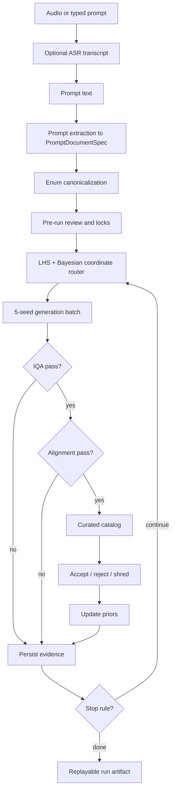

# Bruteforce Canvas

Bruteforce Canvas is an experimental self-curating image generation engine. It turns one user intent into a structured search problem, sweeps prompt-token and seed combinations, evaluates the resulting images, learns which combinations stay inside the image model's training distribution, and promotes only the strongest candidates into a curated catalog.

The project is built around a practical bottleneck in image tools: when a generator stops after one prompt, the user becomes the optimizer. They must think of the next prompt, retry seeds, remember what worked, discard broken outputs, and mentally infer which words improved quality. Bruteforce Canvas moves that cognitive burden into a repeatable backend loop.

The long-term aim is a system that can build an increasingly useful dataset for the user's own image-quality model. Automated evaluators catch low-quality or off-prompt images first; human feedback then adds personal taste, style, and failure preferences. Over time, the engine should learn not just what generally looks good, but what looks good for this user and this visual domain.

## Status

This repository is a research and engineering prototype. The license status is not finalized in this README. Do not treat this document as a license grant.

Runtime integrations are intentionally adapter-based. Local development can run with static adapters and deterministic fixtures; real runs can wire in ASR, an OpenAI-compatible prompt LLM, a fast image generator, IQA, VLM alignment, and optional impact scoring through environment configuration.

## What It Does

Bruteforce Canvas converts a natural language request into a measurable generation experiment.

Given typed text or transcribed audio, the system:

1. Extracts the user's intended scene, objects, relations, style, constraints, and cinematography into a structured prompt document.
2. Normalizes raw language into standardized cinematic and photography terms.
3. Preserves explicit user intent as locked fields and exposes weak or missing fields as sampleable search dimensions.
4. Uses Latin-hypercube-style coverage plus Bayesian priors to choose prompt-coordinate combinations.
5. Generates multiple seeds per coordinate instead of trusting one image.
6. Runs a fast image quality gate before spending more expensive evaluator time.
7. Runs prompt-image alignment on quality survivors.
8. Promotes candidates based on seed-batch survival, not just one lucky sample.
9. Records candidate, score, feedback, and prior updates to a replayable event log.
10. Feeds accepted, rejected, and shredded images back into the search policy.

The product surface is therefore not a prompt box with a gallery. It is a controlled experimentation loop for image generation.

## Why This Exists

Most image-generation interfaces hide the hardest part of the work. They expose the prompt, maybe a seed, and then leave the user to do manual optimization. That creates several problems:

- **Prompt iteration is cognitive labor.** Users must invent variations, remember results, and decide what to retry.
- **Seed luck is mistaken for prompt quality.** A single successful image can hide a brittle prompt.
- **Bad generations waste attention.** Users visually inspect failures that cheap evaluators could have filtered.
- **Preference data is thrown away.** Likes, rejects, and deletes rarely become structured learning signal.
- **Datasets are an afterthought.** The best outputs are not automatically organized as training evidence.

Bruteforce Canvas treats every generation as a data point. The system keeps the prompt coordinate, seed, generator settings, IQA result, alignment result, curation decision, and feedback action together. That makes the run inspectable, replayable, and learnable.

## How It Works

### 1. Prompt Intake

The UI accepts either typed text or microphone audio. Audio is normalized and transcribed into text, then the rest of the pipeline treats the transcript exactly like a typed prompt.

The ASR path is isolated from prompt semantics. That matters because ASR should not decide what is important in the scene; it should only produce faithful text for the prompt compiler.

### 2. Prompt Compiler

The prompt compiler converts raw language into a `PromptDocumentSpec`. This document is the core contract between the UI, router, generator, evaluators, and persistence layer.

It captures:

- scene graph elements,
- object descriptors,
- relation descriptors,
- action lanes,
- cinematography lanes,
- constraints,
- evidence spans,
- verification issues,
- canonical enum matches,
- target manifests for image evaluation.

The key engineering rule is that raw intent is preserved. The system can normalize "inside a glass display case" into canonical terms, but it keeps the original evidence so downstream failures remain explainable.

### 3. Canonicalization

Raw prompt phrases are mapped to project enums before generation. This gives the router a typed search space instead of an unbounded text mutation problem.

Examples of canonicalized dimensions include:

- object role,
- entity type,
- color,
- material,
- finish,
- lighting,
- framing,
- camera angle,
- relation type,
- constraint strength.

The embedding-first canonicalizer provides a deterministic first pass. An LLM fallback can be enabled for uncertain matches, but the fallback is field-scoped: it sees the field and local enum context, not the whole prompt. That keeps canonicalization narrow and easier to test.

### 4. Pre-Run Review And Locks

Before generation begins, the user can review what the system understood. Explicit or user-approved values become locked. Weak, missing, or user-editable fields become search axes.

This is the boundary between intent and optimization:

- locked fields protect what the user asked for,
- sampleable fields let the engine explore,
- thresholds define the minimum acceptable evidence for promotion.

The UI should not behave like a graph editor. It is a trust-but-adjust checkpoint before the backend starts sweeping.

### 5. Coordinate Search

The router proposes generation coordinates across sampleable enum dimensions. A coordinate is a structured prompt variant, not a random rewritten prompt.

The routing policy combines:

- Latin-hypercube-style coverage across enum axes,
- compatibility constraints between enum values,
- Thompson-style arm priors for individual enum choices,
- optional GP-style affinity over enum combinations,
- feedback deltas from accepted, rejected, and shredded candidates.

The result is an exploration policy that can try broad coverage early and become more exploitative as evidence accumulates.

### 6. Seed Sweeping

Each selected coordinate expands into a fixed seed bundle. The default runtime path uses a five-seed sweep. This is important because prompt quality is not the same thing as one lucky output.

Promotion is based on batch behavior:

- one survivor means fragile,
- two survivors means viable,
- three or more survivors means strong.

This gives the system a cheap robustness estimate for each prompt coordinate.

### 7. Fast Generation

The generator adapter is model-agnostic. The current real path targets a fast preview generator, while tests and local development can use a stub generator.

The important interface is simple:

```text
rendered prompt + seed + generation settings -> image artifact + metadata
```

That adapter boundary keeps the rest of the engine independent from one image backend.

### 8. Automated Evaluation

Evaluation is staged deliberately.

First, IQA filters image quality. Low-quality images are retained as evidence but do not spend VLM alignment time.

Second, VLM alignment checks whether quality survivors match the compiled prompt and target manifest.

Third, optional impact scoring can run downstream of required gates. It is informational by default and should stay disabled unless capacity, policy, and licensing conditions are clear.

This order is an AI-engineering choice: cheap gates first, expensive semantic gates later, optional metadata last.

### 9. Curated Catalog

The catalog only promotes candidates that survived automated checks. Failed images are not silently deleted; they are useful negative evidence. The UI can show them muted or keep them in diagnostics while focusing user attention on candidates worth reviewing.

Each promoted image carries:

- candidate id,
- coordinate id,
- seed,
- rendered prompt,
- generator settings,
- IQA score,
- alignment score,
- promotion band,
- feedback state,
- persistence record references.

### 10. Feedback And Learning

Human feedback is intentionally small and high-signal:

- **accept** means the candidate should influence future search positively,
- **reject** means it is not preferred,
- **shred** means the candidate is a stronger negative example.

Those actions update priors for enum arms and combinations. The feedback is also useful as future dataset labeling for a user-specific IQA model.

### 11. Persistence And Replay

Every major backend event is written to JSONL:

- run configuration,
- prompt documents,
- coordinates,
- generation requests,
- candidate records,
- image evaluations,
- aggregate seed-batch stats,
- feedback actions,
- prior updates,
- stop reasons,
- diagnostics.

This makes a run auditable. A static report or replay UI can reconstruct why an image was generated, why it passed or failed, and how it affected later search.

## Data Science View

Bruteforce Canvas frames image generation as sequential experimental design.

The basic unit of observation is:

```text
(prompt coordinate, seed, generation settings) -> image -> evaluator scores -> feedback
```

The feature space is built from canonical prompt enums and compatibility relationships. The target signals are automated quality, automated alignment, batch survival, and human feedback.

The learning problem is not "find the best prompt globally." It is closer to:

```text
Given a base user intent, estimate which prompt-token combinations and seed neighborhoods produce images that are high quality, aligned, and preferred by this user.
```

The current policy uses lightweight Bayesian structure:

- arm-level alpha/beta priors for individual enum choices,
- compatibility priors for known good or bad pairings,
- GP-style combination scoring when enough observations exist,
- explicit feedback deltas for accept/reject/shred,
- batch survival as a robustness proxy.

This is deliberately pragmatic. The system needs enough statistical memory to improve the next sweep, but it should stay interpretable enough that a user can inspect why a coordinate was selected.

## AI Engineering View

The codebase separates heavy model behavior behind adapters:

- prompt LLM client,
- ASR transcriber,
- embedding canonicalizer,
- generator adapter,
- IQA adapter,
- VLM alignment adapter,
- optional impact adapter.

Static adapters keep tests deterministic and let backend development run without GPU dependencies. Real adapters lazy-import heavy libraries so the package can be installed for core backend work without pulling the full model stack.

The main engineering contracts are:

- Pydantic schemas for prompt documents and runtime records,
- adapter methods with small input/output surfaces,
- JSONL persistence for replayability,
- explicit stage gates for generation and evaluation,
- environment-based runtime configuration,
- optional dependency extras for UI, ASR, and ML workloads.

This keeps the system deployable in multiple profiles:

- backend-only development,
- Gradio simulation,
- Gradio runtime with static evaluators,
- runtime with real ASR,
- runtime with real generator and evaluators,
- external generator service with local orchestration.

## Model And Adapter Stack

| Stage | Adapter | Default / expected role |
| --- | --- | --- |
| ASR | `LocalCohereTranscriber` | Converts microphone audio into prompt text. |
| Prompt LLM | `OpenAICompatibleServerJsonLLMClient` | Calls an externally configured OpenAI-compatible JSON-schema server for extraction, repair, and verification. |
| Canonicalization | `EmbeddingCanonicalizerAdapter` | Maps raw field values into canonical enum arms. |
| Fallback canonicalization | `LLMCanonicalizerAdapter` | Optional field-scoped fallback when embedding confidence is low. |
| Generation | `StubGeneratorAdapter`, `BonsaiTernaryAdapter`, `BonsaiHttpAdapter` | Produces seed-sweep image artifacts. |
| IQA | `JoyQualityAdapter` | Fast image-quality screen before alignment. |
| Alignment | `MiniCPMVAdapter` or `OpenAICompatibleVLMAlignmentAdapter` | Checks prompt-image match against the compiled target manifest. |
| Optional impact | `TRIBEv2Adapter` | Optional downstream metadata, disabled by default. |
| Routing | `LHSRouter`, `ThompsonArmState`, compatibility priors, combo GP helpers | Selects the next prompt coordinate. |
| Persistence | `JsonlEventStore` | Records the run for replay and analysis. |

Concrete private service endpoints, tokens, and deployment-specific model names should be supplied through environment variables or external secrets, not committed into the repository.

## Workflow



## Installation Profiles

Create and activate a local virtual environment:

```bash
uv venv .venv --python 3.12
source .venv/bin/activate
```

Install backend core plus test tooling:

```bash
uv pip install -e '.[dev]'
```

Install the Gradio UI only when you need the UI or Gradio-specific tests:

```bash
uv pip install -e '.[dev,ui]'
```

Install microphone ASR dependencies:

```bash
uv pip install -e '.[dev,ui,asr]'
```

Install real-model ML dependencies:

```bash
uv pip install -e '.[ml]'
```

Install everything for a real-model UI development environment:

```bash
uv pip install -e '.[dev,ui,asr,ml]'
```

The UI dependencies are intentionally not part of the backend/dev extra. Backend tests and core engine development should not require Gradio.

## Configuration

Common local defaults:

```bash
export BC_GENERATOR=stub
export BC_DEVICE=auto
export BC_DEVICE_PREWARM=true
export BC_IQA_CUTOFF=0.55
export BC_ALIGNMENT_CUTOFF=0.25
export BC_IMPACT_ENABLED=false
export BC_EVENT_STORE=runtime/events.jsonl
```

Configure the prompt LLM with an external OpenAI-compatible server:

```bash
export BC_LLM_PROVIDER=openai-compatible-server
export BC_LLM_BASE_URL=https://your-json-llm.example/v1
export BC_LLM_MODEL=your-json-model
export BC_LLM_API_KEY=...
export BC_LLM_TIMEOUT_SECONDS=600
export BC_LLM_PREWARM=true
```

Runtime launch can prewarm the configured prompt LLM by sending one small `PromptDocumentSpec` request before binding the UI. Set `BC_LLM_PREWARM=false` for local debugging, or `BC_LLM_PREWARM_REQUIRED=true` when startup should fail instead of continuing after a warmup error.

ASR prewarm options:

```bash
export BC_ASR_PREWARM=true
export BC_ASR_PREWARM_INFERENCE=true
export BC_ASR_PREWARM_REQUIRED=false
export BC_ASR_RELEASE_AFTER_TRANSCRIBE=false
export BC_ASR_RELEASE_BEFORE_RUNTIME_SERVICE=false
```

Configure an external fast image backend through HTTP:

```bash
export BC_GENERATOR=bonsai-http
export BC_BONSAI_HTTP_URL=http://127.0.0.1:7950
export BC_BONSAI_HTTP_TOKEN=...
```

Or configure a local generator backend kept outside this repository:

```bash
export BC_GENERATOR=bonsai
export BC_DEVICE=cuda
export BC_BONSAI_BACKEND_ROOT=/path/to/external/Bonsai-Image-Demo
export BC_BONSAI_MODEL_ROOT=runtime/models/bonsai-image-4B-ternary-gemlite
export BC_BONSAI_TRITON_CACHE=runtime/.triton_cache
export BC_BONSAI_KERNEL_WARMUP=true
```

With `BC_BONSAI_KERNEL_WARMUP=true`, startup runs one disposable `512x512` dummy generation with `steps=4` after loading the pipeline. Override the warmup workload with `BC_BONSAI_WARMUP_PROMPT`, `BC_BONSAI_WARMUP_STEPS`, `BC_BONSAI_WARMUP_HEIGHT`, and `BC_BONSAI_WARMUP_WIDTH`, or disable it with `BC_BONSAI_KERNEL_WARMUP=false`.

Fast-parse runtime profile:

```bash
export BC_RUNTIME_FAST_PARSE=true
```

Fast parse keeps LLM extraction and embedding canonicalization, but disables the more expensive semantic validation, verifier calls, verifier repair loops, and LLM fallback canonicalization. Set `BC_RUNTIME_FAST_PARSE=false` to restore the stricter compiler, or selectively re-enable gates with:

```bash
export BC_RUNTIME_SEMANTIC_VALIDATION=true
export BC_RUNTIME_VERIFIER=true
export BC_RUNTIME_SEMANTIC_REPAIRS=1
export BC_RUNTIME_VERIFIER_REPAIRS=1
export BC_RUNTIME_LLM_CANONICALIZER_FALLBACK=true
```

## Running The UI

Launch the Gradio simulation UI:

```bash
.venv/bin/python -m bruteforce_canvas.cli gradio-ui --host 127.0.0.1 --port 7860
```

Launch the Gradio UI wired to backend runtime:

```bash
export BC_GRADIO_MODE=runtime
export BC_GENERATOR=bonsai-http
export BC_BONSAI_HTTP_URL=http://127.0.0.1:7950
export BC_DEVICE=cuda
export BC_IQA_MODE=real
export BC_VLM_MODE=real
export BC_LLM_BASE_URL=https://your-json-llm.example/v1
export BC_LLM_MODEL=your-json-model
.venv/bin/python -m bruteforce_canvas.cli gradio-ui --mode runtime --host 127.0.0.1 --port 7860
```

Runtime mode prewarms configured services when enabled, parses prompts through the backend prompt pipeline, prewarms generator/evaluator adapters during pre-run review, enqueues five-seed batches through `RunService`, persists records under `runtime/gradio_runs/<run_id>/events.jsonl`, and sends feedback through the backend feedback policy.

## Replay And Inspection

Render a recorded run into an HTML workspace:

```bash
.venv/bin/python -m bruteforce_canvas.cli render-workspace \
  --store runtime/events.jsonl \
  --output runtime/workspace.html \
  --diagnostics
```

Start the event stream used by UI integrations:

```bash
.venv/bin/python -m bruteforce_canvas.cli stream --run-id run_001 --port 8765
```

Run a real generator smoke test when you need an explicit PNG artifact:

```bash
.venv/bin/python -m bruteforce_canvas.cli bonsai-smoke --output-dir runtime/bonsai_smoke
```

Cache the ASR model before first microphone use:

```bash
.venv/bin/python -m bruteforce_canvas.cli cache-asr
```

## Testing

Run the full suite:

```bash
.venv/bin/python -m pytest -q
```

Run focused checks after adapter, config, or UI changes:

```bash
.venv/bin/python -m pytest tests/test_app_config.py tests/test_app_factory.py tests/test_llm_clients.py -q
.venv/bin/python -m pytest tests/test_real_adapters.py -q
.venv/bin/python -m pytest tests/test_gradio_ui.py -q
```

Real model tests are intentionally guarded. The normal suite should remain useful on machines without the full ML stack.

## Practical Notes

- Keep private model endpoints, tokens, and deployment-specific runtime values out of Git.
- Keep the external generator backend outside this repository and point to it with environment variables.
- Use static adapters for deterministic backend tests.
- Use real adapters only in explicit runtime or real-model verification profiles.
- Treat generated images, videos, audio, caches, and run logs as runtime artifacts unless there is a specific reason to version them.
